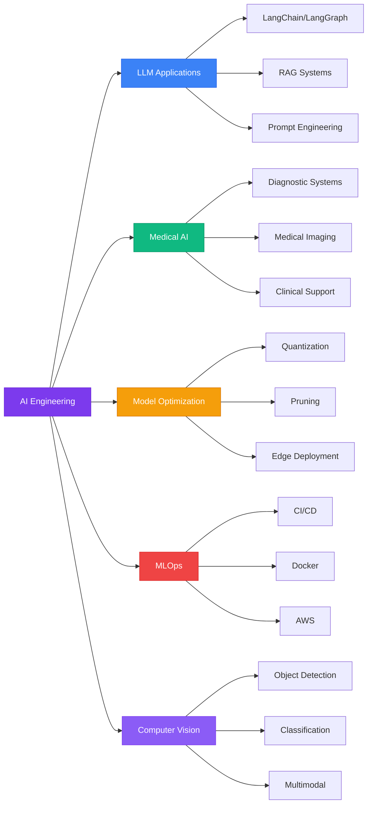

<div align="center">

# Ahmed Elkossairy

### AI Engineer | Medical AI Specialist | MLOps Expert

<p>
<a href="https://linkedin.com/in/ahmed-elkossairy-96b34a26a"></a>
<a href="https://www.kaggle.com/ahmedelkossairy"></a>
<a href="mailto:Elkossairyahmed87@gmail.com"></a>
<a href="https://github.com/D-engahmed"></a>
</p>


</div>

---

## 📊 Professional Summary

<table>
<tr>
<td width="30%" align="center">

<br/><br/>

</td>
<td width="70%">

AI Engineer specializing in **production-grade machine learning systems** with deep expertise in Medical AI, Large Language Models, and MLOps. Proven track record of deploying 15+ AI solutions across healthcare, NLP, and computer vision domains.

**🎓 Education:** B.Sc. Electronics & Communications Engineering, Helwan University (2027)  
**📍 Location:** Cairo, Egypt  
**☁️ Current Focus:** AWS ML Certification | Advanced RAG Systems | Medical AI

</td>
</tr>
</table>

<div align="center">

### 🏆 Key Performance Indicators

| Metric | Value | Visual |
|:------:|:-----:|:------:|
| 🚀 **Production Systems** | 15+ Deployed |  |
| 🎯 **Medical AI Accuracy** | 90%+ |  |
| ⚡ **Model Optimization** | 75% Reduction |  |
| 👥 **Daily Users** | 1,000+ |  |
| 📊 **Data Processed** | 5M+ Records |  |
| 🏥 **Clinical Accuracy** | 97% |  |

</div>

---

## 🛠️ Technical Stack

<div align="center">

### Programming Languages & Core Skills

<p>


</p>

### AI/ML Frameworks & Deep Learning

<p>


</p>

### LLM & NLP Technologies

<p>


</p>

### Cloud & MLOps

<p>


</p>

### Proficiency Distribution

```text
Python & ML Frameworks     ████████████████████  95%  █▓▒░
LLM & NLP Technologies     ████████████████░░░░  80%  █▓▒░
Computer Vision & CV       █████████████████░░░  85%  █▓▒░
Model Optimization         ████████████████░░░░  80%  █▓▒░
Cloud & MLOps (AWS)        ██████████████░░░░░░  70%  █▓▒░
Vector Databases & RAG     ███████████████░░░░░  75%  █▓▒░
```

</div>

<details>
<summary><b>📋 Detailed Technical Skills Matrix</b></summary>

<br/>

<table>
<tr>
<td width="50%" valign="top">

**Core Technologies**

| Skill | Level | Progress |
|:------|:-----:|:--------:|
| Python | Expert |  |
| PyTorch | Expert |  |
| TensorFlow | Advanced |  |
| Scikit-learn | Expert |  |

**Deep Learning**
- CNN, RNN, LSTM, GRU
- Transformer Architectures
- Attention Mechanisms
- Multimodal Learning

</td>
<td width="50%" valign="top">

**Specialized Skills**

| Skill | Level | Progress |
|:------|:-----:|:--------:|
| LangChain | Advanced |  |
| RAG Systems | Advanced |  |
| Model Optimization | Expert |  |
| Medical Imaging | Advanced |  |

**Computer Vision**
- Medical Imaging Analysis
- Object Detection
- Vision-Language Models

</td>
</tr>
</table>

</details>

---

## 🚀 Featured Projects

### 🏥 BiMediX2 - Multimodal Medical Diagnosis Platform

<div align="center">


</div>

<table>
<tr>
<td width="60%">

**Production medical AI system with explainable reasoning**

**🎯 Technical Achievements:**
- ✅ Deployed multimodal AI combining text + medical images
- ✅ INT8 quantization: 75% model size reduction
- ✅ Intelligent doctor recommendation with specialty matching
- ✅ Patient follow-up with appointment tracking
- ✅ 10,000+ medicine database with vector search
- ✅ Sub-200ms inference for real-time clinical use
- ✅ Explainable AI with reasoning chains

**💻 Technology Stack:**
```
Core: PyTorch | Multimodal Transformers
Backend: FastAPI | ONNX Runtime
AI: RAG | Medical Imaging | NLP
Optimization: INT8 Quantization
```

</td>
<td width="40%" align="center">

**Performance Metrics**

| Metric | Score |
|:------:|:-----:|
| **Accuracy** | 90%+ |
| **Size Reduction** | 75% |
| **Inference** | <200ms |

<br/>


**Diagnosis Accuracy**


**Optimization**


**Speed Score**

</td>
</tr>
</table>

---

### 💻 AI-Powered VS Code Extension

<div align="center">


</div>

<table>
<tr>
<td width="60%">

**Privacy-first local LLM development assistant**

**🔥 Key Features:**
- 🔒 100% offline processing (zero-latency)
- 🎨 Multimodal: code + images + documents
- 🤖 Context-aware workspace suggestions
- 👥 1,000+ daily active users
- ⭐ 95% user satisfaction rate
- 🚀 Full VS Code API integration

**💻 Technology Stack:**
```
Core: Python | VS Code Extension API
AI: LangChain | Local LLMs
Processing: Multimodal Analysis
Storage: Vector DB | RAG Systems
```

**[📂 View Repository →](https://github.com/D-engahmed)**

</td>
<td width="40%" align="center">

**User Metrics**


**Uptime**


**Satisfaction**


**Privacy**

<br/>

| Daily Stats |
|:-----------:|
| 👥 1,000+ Users |
| 💬 10,000+ Queries |
| ⚡ 0ms Latency |

</td>
</tr>
</table>

---

### 📄 Advanced Text Summarization System

<div align="center">


</div>

<table>
<tr>
<td width="60%">

**Hybrid abstractive/extractive summarization**

**📊 Research Achievements:**
- 📈 25% ROUGE score improvement over baselines
- ⚡ 60% faster processing through distillation
- 🔄 Fine-tuned BART, T5, and PEGASUS models
- 📚 Multi-document with coherence optimization
- 🎯 Domain-specific dataset adaptation

**💻 Technology Stack:**
```
Models: BART | T5 | PEGASUS
Framework: Transformers | PyTorch
Techniques: Fine-tuning | Distillation
NLP: Tokenization | Domain Adaptation
```

**[📂 View Repository →](https://github.com/D-engahmed/text_summarize)**

</td>
<td width="40%" align="center">

**Performance Gains**

| Metric | Improvement |
|:------:|:-----------:|
| ROUGE-1 | +25% |
| ROUGE-L | +22% |
| Speed | +60% |

<br/>


**ROUGE Score**


**Processing Speed**

</td>
</tr>
</table>

---

### 🔬 Breast Cancer Detection System

<div align="center">


</div>

<table>
<tr>
<td width="50%">

**Clinical-grade ML classification**

**🏥 Medical AI Implementation:**
- 🎯 97% accuracy, 95% recall
- 🔍 Ensemble: SVM + RF + LR
- 📊 Advanced feature selection (RFE, LASSO)
- ✅ Robust cross-validation
- 🏥 Clinical deployment ready

**💻 Tech:** `Scikit-learn` `Ensemble` `Medical AI`

**[📂 Repository →](https://github.com/D-engahmed/breast_cancer)**

</td>
<td width="50%" align="center">

**Clinical Metrics**


**Accuracy**


**Recall**


**Precision**


**F1-Score**

</td>
</tr>
</table>

---

### ✈️ Airline Delay Prediction & Analytics

<div align="center">


</div>

<table>
<tr>
<td width="50%">

**Enterprise-scale predictive modeling**

**📊 Data Engineering:**
- 📈 5M+ flight records processed
- 🎯 85% prediction accuracy
- 🔧 +30% from feature engineering
- 📉 Interactive Power BI dashboard
- 🔍 Root cause analysis

**💻 Tech:** `Python` `Time Series` `Power BI`

**[📂 Repository →](https://github.com/D-engahmed/Airline_Delay_Cause)**

</td>
<td width="50%" align="center">

**Analytics Scale**

| Metric | Value |
|:------:|:-----:|
| Records | 5M+ |
| Features | 50+ |
| Models | 8 |


**Prediction**


**Data Coverage**

</td>
</tr>
</table>

---

### 🧠 Deep Learning Text Classification Suite

<div align="center">


</div>

<table>
<tr>
<td width="50%">

**Comprehensive NLP research framework**

**🧠 Implementation:**
- 🎯 92% sentiment analysis accuracy
- 🔬 Benchmarked RNN, LSTM, GRU
- ⚡ Attention mechanisms integrated
- 📦 Production-ready pipeline
- 📚 Educational resources included

**💻 Tech:** `PyTorch` `RNN` `LSTM` `GRU` `NLP`

**[📂 Repository →](https://github.com/D-engahmed/pytorch_rnn_text_classification)**

</td>
<td width="50%" align="center">

**Model Performance**


**RNN**


**LSTM**


**GRU**


**+ Attention**

</td>
</tr>
</table>

---

### 💰 Medical Expenses Prediction System

<div align="center">


</div>

<table>
<tr>
<td width="50%">

**Healthcare cost forecasting with interpretability**

**💡 Predictive Analytics:**
- 📊 R² score: 0.87
- 🎯 Ensemble methods (RF, XGBoost, GB)
- 🔍 SHAP values for interpretability
- 🔧 Extensive feature engineering
- 💼 Insurance underwriting insights

**💻 Tech:** `Scikit-learn` `XGBoost` `SHAP`

**[📂 Repository →](https://github.com/D-engahmed/medical_exprnses)**

</td>
<td width="50%" align="center">

**Model Performance**

| Model | R² Score |
|:------|:--------:|
| RF | 0.84 |
| XGBoost | 0.87 |
| GB | 0.85 |


**R² Score**


**Interpretability**

</td>
</tr>
</table>

---

## 📈 Professional Impact Dashboard

<div align="center">

### Overall Performance Metrics

<table>
<tr>
<td align="center" width="33%">

**🚀 Deployment**
<br/><br/>

<br/><br/>


</td>
<td align="center" width="33%">

**🎯 Accuracy**
<br/><br/>

<br/><br/>


</td>
<td align="center" width="33%">

**⚡ Optimization**
<br/><br/>

<br/><br/>


</td>
</tr>
</table>

### Domain Impact Distribution

| Domain | Projects | Impact Score | Visualization | Status |
|:-------|:--------:|:------------:|:-------------:|:------:|
| 🏥 Medical AI | 3 | 95/100 |  |  |
| 🤖 LLM/NLP | 4 | 90/100 |  |  |
| 👁️ Computer Vision | 2 | 85/100 |  |  |
| 📊 Data Analytics | 2 | 88/100 |  |  |
| ⚡ Optimization | 5 | 92/100 |  |  |

### Year-Over-Year Growth

```text
2024  ████████████████████  BiMediX2 (90%+) | VS Code Ext (1K users) | Text Sum (+25%)
      │                     
2023  ████████████████░░░░  Text Class (92%) | Cancer Det (97%) | Airlines (5M)
      │                     
2022  ████████████░░░░░░░░  Medical Costs (0.87) | Foundation Projects
```

</div>

---

## 🎓 Education & Certifications

<div align="center">

### 🏛️ Academic Background

<table>
<tr>
<td align="center" width="100%">

**Bachelor of Science - Electronics & Communications Engineering**  
🏫 Helwan University | 📅 Expected 2027 | 🇪🇬 Egypt

**Relevant Coursework:** ML, DL, NLP, CV, Signal Processing, Pattern Recognition, Embedded AI

</td>
</tr>
</table>

### 📜 Professional Certifications Progress

<table>
<tr>
<td width="50%" align="center">

**☁️ Cloud & Infrastructure**

| Certification | Status | Progress |
|:--------------|:------:|:--------:|
|  | 🔄 In Progress |  |
|  | 🔄 In Progress |  |
|  | 🔄 In Progress |  |

</td>
<td width="50%" align="center">

**🤖 AI/ML Specializations**

| Certification | Status | Progress |
|:--------------|:------:|:--------:|
|  | ✅ Completed |  |
|  | ✅ Completed |  |
|  | ✅ Completed |  |

</td>
</tr>
</table>

</div>

---

## 💼 Areas of Specialization

<div align="center">

### Expertise Radar Chart



### Proficiency Matrix

<table>
<tr>
<td align="center" width="20%">

**🏥 Medical AI**
<br/><br/>

<br/><br/>

<br/>
Diagnostic Systems<br/>
Medical Imaging<br/>
Clinical Decision

</td>
<td align="center" width="20%">

**🤖 LLM Engineering**
<br/><br/>

<br/><br/>

<br/>
LangChain/Graph<br/>
RAG Systems<br/>
Prompt Engineering

</td>
<td align="center" width="20%">

**⚡ Optimization**
<br/><br/>

<br/><br/>

<br/>
Quantization<br/>
Pruning<br/>
ONNX

</td>
<td align="center" width="20%">

**☁️ MLOps**
<br/><br/>

<br/><br/>

<br/>
Docker<br/>
FastAPI<br/>
AWS (Learning)

</td>
<td align="center" width="20%">

**👁️ Computer Vision**
<br/><br/>

<br/><br/>

<br/>
Object Detection<br/>
Medical Imaging<br/>
Multimodal

</td>
</tr>
</table>

### Detailed Skills Breakdown

| Category | Technologies | Proficiency | Projects |
|:---------|:------------|:-----------:|:--------:|
| 🏥 **Medical AI** | PyTorch, Medical Imaging, Clinical Systems |  | 3 |
| 🤖 **LLM & NLP** | LangChain, RAG, Transformers, OpenAI |  | 4 |
| ⚡ **Model Optimization** | INT8/FP16, ONNX, Pruning, Distillation |  | 5 |
| ☁️ **MLOps** | Docker, FastAPI, CI/CD, AWS |  | 6 |
| 👁️ **Computer Vision** | OpenCV, Object Detection, Classification |  | 2 |
| 📊 **Data Science** | Pandas, NumPy, Feature Engineering |  | 7 |

</div>

---

## 📊 GitHub Analytics

<div align="center">

### Contribution Overview


### Language Distribution & Activity


### GitHub Achievements

[](https://github.com/ryo-ma/github-profile-trophy)

### Repository Statistics

| Metric | Count | Visualization |
|:-------|:-----:|:-------------:|
| 📦 Public Repos | 7+ |  |
| ⭐ Total Stars | Growing |  |
| 🔀 Forks | Active |  |
| 👥 Followers | Expanding |  |

</div>

---

## 🎯 Professional Experience Timeline

<div align="center">

### Project Deployment History

```text
2024  ████████████████████  BiMediX2 Medical Platform (90%+ accuracy)
      ████████████████████  VS Code AI Extension (1,000+ users)
      ███████████████░░░░░  Advanced Text Summarization (+25% ROUGE)
      │
      │  Impact: 3 major deployments, 1,000+ active users
      │
2023  ████████████████░░░░  Deep Learning Text Classification (92%)
      ███████████████░░░░░  Breast Cancer Detection System (97%)
      ██████████████░░░░░░  Airline Delay Prediction (5M records)
      ████████████░░░░░░░░  Medical Expenses Prediction (R²: 0.87)
      │
      │  Impact: 4 production systems, 5M+ records processed
      │
2022  ████████░░░░░░░░░░░░  Foundation Projects & Research
      │
      │  Focus: ML fundamentals, model development
```

### Monthly Contribution Activity

<table>
<tr>
<td align="center" width="14%">

**Jan**<br/>


</td>
<td align="center" width="14%">

**Feb**<br/>


</td>
<td align="center" width="14%">

**Mar**<br/>


</td>
<td align="center" width="14%">

**Apr**<br/>


</td>
<td align="center" width="14%">

**May**<br/>


</td>
<td align="center" width="14%">

**Jun**<br/>


</td>
<td align="center" width="14%">

**Jul+**<br/>


</td>
</tr>
</table>

</div>

**Career Highlights:**
- ✅ Designed and deployed **15+ end-to-end AI solutions** across healthcare, NLP, and computer vision
- ✅ Built production ML pipelines from data collection through deployment
- ✅ Engineered VS Code extension serving **1,000+ daily active users**
- ✅ Delivered freelance AI projects with **100% client satisfaction**
- ✅ Active open-source contributor with **7+ public repositories**
- ✅ Specialized in MLOps: model versioning, CI/CD, automated deployment
- ✅ Research focus on model optimization for edge devices

---

## 🔬 Current Focus & Development

<div align="center">

<table>
<tr>
<td width="33%" align="center">

### ☁️ Cloud Mastery


**Focus Areas:**
- SageMaker Deployment
- EC2/S3 Infrastructure
- Lambda Functions
- Scalable ML Systems


</td>
<td width="33%" align="center">

### 🏥 Medical AI


**Focus Areas:**
- Multimodal Diagnosis
- Clinical Integration
- Explainable AI
- Patient Monitoring


</td>
<td width="33%" align="center">

### ⚡ Optimization


**Focus Areas:**
- Advanced Quantization
- Real-time Inference
- Edge Deployment
- Model Compression


</td>
</tr>
</table>

### Research Interests

| Area | Status | Priority | Technologies |
|:-----|:------:|:--------:|:-------------|
| 🧠 Advanced RAG Systems |  | High | LangChain, Vector DBs |
| 🎨 Multimodal AI |  | High | Vision-Language Models |
| ⚡ Model Compression |  | Medium | Quantization, Pruning |
| 🏥 Clinical AI Integration |  | High | Healthcare Systems |
| ☁️ AWS Infrastructure |  | High | Cloud Deployment |

</div>

---

## 🤝 Collaboration & Open Source

<div align="center">

### Open to Collaborating On

<table>
<tr>
<td align="center" width="20%">

**🏥 Medical AI**
<br/><br/>

<br/><br/>
Diagnostic Systems<br/>
Clinical Tools<br/>
Healthcare Tech

</td>
<td align="center" width="20%">

**🤖 LLM Apps**
<br/><br/>

<br/><br/>
RAG Systems<br/>
Agent Frameworks<br/>
Prompt Engineering

</td>
<td align="center" width="20%">

**🎨 Multimodal**
<br/><br/>

<br/><br/>
Vision-Language<br/>
Cross-Modal<br/>
Fusion Systems

</td>
<td align="center" width="20%">

**⚡ Optimization**
<br/><br/>

<br/><br/>
Quantization<br/>
Edge Deployment<br/>
Compression

</td>
<td align="center" width="20%">

**☁️ MLOps**
<br/><br/>

<br/><br/>
Production Pipelines<br/>
Cloud Deploy<br/>
CI/CD

</td>
</tr>
</table>

### Contribution Philosophy

> *"Building production-grade AI systems that deliver measurable impact. Specializing in medical AI, model optimization, and scalable ML infrastructure."*

</div>

---

## 📫 Professional Network

<div align="center">

### Let's Connect

<table>
<tr>
<td align="center" width="25%">

[](https://linkedin.com/in/ahmed-elkossairy-96b34a26a)

**Professional**<br/>
Networking

</td>
<td align="center" width="25%">

[](https://www.kaggle.com/ahmedelkossairy)

**Data Science**<br/>
Competitions

</td>
<td align="center" width="25%">

[](mailto:Elkossairyahmed87@gmail.com)

**Direct**<br/>
Communication

</td>
<td align="center" width="25%">

[](https://github.com/D-engahmed)

**Open Source**<br/>
Collaboration

</td>
</tr>
</table>

### Response Time

| Channel | Typical Response | Availability |
|:--------|:----------------|:------------:|
| 📧 Email | 24-48 hours |  |
| 💼 LinkedIn | 1-2 days |  |
| 🐙 GitHub | Varies |  |

---

### 📊 Profile Summary

**15+ Production Systems** | **90%+ Medical AI Accuracy** | **75% Model Optimization** | **1,000+ Daily Users** | **5M+ Records Processed**

---


